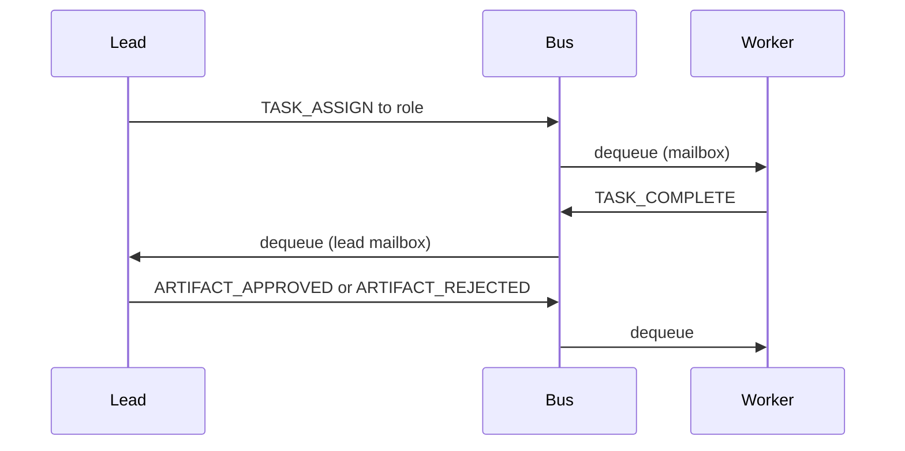

# AgentForge — Multi-Agent AI Software Company

## Mission
A team of AI agents operating as a software company to build **DailyEase** — a daily life
management platform simplifying day-to-day activities for millions of users.

## Product: DailyEase
Four core modules:
| Module | What it does |
|--------|-------------|
| Task Management | AI-prioritized tasks, due dates, completion tracking |
| Habit Tracking | Habit logging, streak analytics, frequency goals |
| Personal Finance | Income/expense tracking, budgets, category summaries |
| Wellness Reminders | Sleep, hydration, exercise, medication reminders |

**Target:** 100k+ concurrent users, sub-200ms API response time.

---

## Architecture

### Agent Team

| Agent | Role | Artifacts Produced |
|-------|------|--------------------|
| **Lead** | Orchestrates all agents, enforces phase gates, consults the Reviewer at the approval gate | Sprint decisions, approval records |
| **Reviewer** | Independent code review — reads the actual files and judges spec compliance, drift, security, logic, standards | Structured verdict (approve / reject / escalate) consumed by the Lead |
| **Product Manager** | Writes requirements docs, user stories, API overviews | `workspace/docs/requirements.md` |
| **Software Architect** | Designs system architecture, DB schema, API contracts | `workspace/docs/architecture.md` |
| **Backend Developer** | Implements FastAPI app (models, schemas, routers, services) | `workspace/dailyease/` (20+ files) |
| **QA Engineer** | Writes pytest suite, bug reports, QA analysis | `workspace/dailyease/tests/`, `workspace/reports/qa_report.md` |
| **DevOps Engineer** | Writes Dockerfile, docker-compose, CI/CD pipeline, runbook | `workspace/dailyease/Dockerfile`, `.github/workflows/ci.yml`, `workspace/docs/deployment.md` |

### Communication Model
```
Lead (orchestrator)
  │
  ├─► PM          TASK_ASSIGN ──► [work] ──► TASK_COMPLETE ──► Lead reviews
  ├─► Architect   (phase-gated: PM must be approved first)
  ├─► Backend     (depends on approved architecture)
  ├─► QA          (reviews backend implementation)
  └─► DevOps      (deploys QA-approved code)

Approval loop (per agent):
  Lead sends TASK_ASSIGN ──► Agent produces artifact ──► TASK_COMPLETE
  Lead consults Reviewer (reads the real files) ──► verdict
  Lead publishes ARTIFACT_APPROVED or ARTIFACT_REJECTED (with revision notes)
  Up to 3 revision cycles; a missing verdict defaults to reject (silence ≠ approval).
  Artifacts still failing after 3 cycles are accepted but flagged as unresolved review debt.

Scope lock:
  Agents defer out-of-scope work via a log_known_gap tool instead of expanding the task.
  Reviewer drift + deferred items accumulate in reports/known_gaps.md, surfaced at the deploy gate.
```

### Message bus (implementation)

- **Mailbox:** Each role has an `asyncio.PriorityQueue`. Lower numeric `priority` is dequeued first (typical: Lead control messages `1`, worker completions `2`).
- **Stable ordering:** Ties use a monotonic sequence on publish (not `Message.__lt__`), so heap order is predictable.
- **Shutdown:** Workers stop when they receive `MessageType.SHUTDOWN`.
- **IDs:** Every message has a `message_id`; `correlation_id` is reserved for linking replies (e.g. future consult flow).
- **Audit:** Each `publish` is appended to SQLite `message_log` (large payloads are truncated for storage).

### Lead ↔ workers (sequence overview)



### Directory Structure
```
agents/
├── main.py                   # thin entry → cli.main()
├── cli.py                    # argparse: presets, phases, dry-run, TUI flag
├── tui_main.py               # Textual TUI (buttons + streamed subprocess logs)
├── web_ui.py                 # Local browser UI (FastAPI + WebSocket, loopback)
├── USAGE.md                  # Step-by-step: CLI, TUI, web UI, presets
├── CHANGELOG.md              # User-facing release notes (omit internal-only refactors)
├── improvement.md            # Backlog / shipped improvements
├── tests/                    # pytest (CLI, artifact_store, message_bus)
├── pyproject.toml            # dependencies + [tool.uv]; `agentforge` script
├── uv.lock                   # locked versions for `uv sync`
├── requirements.txt          # pip mirror of deps (optional if using uv)
├── README.md                 # uv + env quickstart; CI badge
├── LICENSE                   # MIT
├── .github/workflows/ci.yml  # pytest on push / PR
├── .env.example              # config template (copy to `.env`)
├── agents_plan.md            # this file
│
├── core/
│   ├── paths.py              # AGENTFORGE_ROOT / workspace / DB resolution
│   ├── phases.py             # DEFAULT_PHASES + CLI presets (intake, test, improve, …)
│   ├── message_types.py      # Message dataclass + MessageType enum
│   ├── message_bus.py        # asyncio.PriorityQueue-based message bus
│   ├── memory.py             # aiosqlite persistent memory (per-role scoped)
│   └── artifact_store.py     # filesystem read/write for workspace/ (path-safe)
│
├── agents/
│   ├── base_agent.py         # BaseAgent: Anthropic SDK + prompt caching + memory
│   ├── lead.py               # LeadAgent: orchestrator + phase gates + reviews
│   ├── product_manager.py    # ProductManagerAgent: requirements docs
│   ├── architect.py          # ArchitectAgent: architecture design
│   ├── backend_developer.py  # BackendDeveloperAgent: FastAPI implementation
│   ├── qa_engineer.py        # QAEngineerAgent: tests + QA report
│   └── devops_engineer.py    # DevOpsEngineerAgent: deployment configs
│
├── workspace/                # All generated artifacts land here
│   ├── docs/
│   │   ├── requirements.md   # PM output
│   │   ├── architecture.md   # Architect output
│   │   └── deployment.md     # DevOps output
│   ├── dailyease/            # The actual product (FastAPI app)
│   │   ├── main.py
│   │   ├── database.py
│   │   ├── models/
│   │   ├── schemas/
│   │   ├── routers/
│   │   ├── services/
│   │   ├── tests/
│   │   ├── Dockerfile
│   │   ├── docker-compose.yml
│   │   └── .github/workflows/ci.yml
│   └── reports/
│       └── qa_report.md      # QA output
│
└── agentforge.db             # SQLite: agent memory + message log
```

---

## Technical Design

### Prompt Caching Strategy
Every agent uses `cache_control: {type: "ephemeral"}` on its system prompt block.
Since system prompts are stable (never include timestamps or per-call data), they are
cached after the first request and served at ~10% cost on all subsequent calls.

Dynamic context (prior decisions, approved artifact paths) is injected in the `messages`
array, *after* the cache breakpoint — it changes each call without invalidating the cache.

Tools are sorted deterministically by name so the tools block is always byte-identical
(unsorted tools would invalidate the cache on every call).

### Phase Gate Enforcement
The Lead enforces strict sequential phases:
1. PM requirements approved → unlock architect
2. Architecture approved → unlock backend developer
3. Backend implementation approved → unlock QA
4. QA approved → unlock DevOps

No agent starts until its dependency is approved by the Lead. This mirrors a real
engineering organization's stage-gate review process.

### Persistent Memory
`AgentMemory` (aiosqlite) stores per-agent context across restarts:
- `artifact_ref`: paths to files each agent has written
- `decision`: strategic/technical decisions recorded by the Lead
- `context`: general sprint state

The Lead uses `recall_cross_role()` to read other agents' artifact refs for review.

---

## Running AgentForge

**Entry points:** [README.md](README.md) (uv + env quickstart) · [USAGE.md](USAGE.md) (full CLI / TUI / web / troubleshooting).

### Package environment: uv (recommended)

[uv](https://docs.astral.sh/uv/) creates **`.venv`** and installs from **`pyproject.toml` + `uv.lock`**.

```bash
# Repository root (where main.py lives)
uv sync
```

Update lockfile after dependency edits: `uv lock && uv sync`.

Run without `source .venv/bin/activate`:

```bash
uv run python main.py --dry-run
uv run agentforge --list-artifacts
```

### Creating environment variables

| Approach | Notes |
|----------|--------|
| **`.env` file** | `cp .env.example .env` then edit. **`python-dotenv`** loads it when AgentForge starts (works with `uv run python main.py …`). |
| **`uv run --env-file .env`** | Injects variables into the process environment before Python starts. |
| **`UV_ENV_FILE`** | Shell export pointing at your env file; applies to `uv run` by default. |
| **`export VAR=value`** | Traditional shell; use for CI secrets or one-off runs. |

Required for real API runs: **`ANTHROPIC_API_KEY`**. See `.env.example` for optional keys.

### Setup (pip alternative)

```bash
python3 -m venv .venv
source .venv/bin/activate   # Windows: .venv\Scripts\activate
pip install -r requirements.txt
pip install -e .            # optional: `agentforge` CLI
cp .env.example .env
# Edit .env (same variables as above)
```

### Run

With **uv**, prefix commands with `uv run` (examples below show both forms).

```bash
# Default DailyEase MVP sprint (full pipeline)
python main.py
# uv run python main.py

# Workflow presets (intake, design, implement, test, ship, improve, full)
python main.py --preset intake --goal "Capture requirements for reminders v2"
python main.py --preset test --goal "Expand API tests for finance module"
python main.py --preset improve --goal "Reduce DB round-trips and add indexes"

# Custom agent order
python main.py --phases pm,architect,backend --goal "Schema + API for habits only"

# Interactive TUI (Textual — preset buttons + streamed logs)
python main.py --tui

# Local browser UI (http://127.0.0.1:8755 — WebSocket log stream)
python main.py --web
python main.py --web --web-port 9000

# Installed console script (after uv sync or pip install -e .)
agentforge --preset ship --goal "Add ghcr.io publish on tag"

# List all generated artifacts after a run
python main.py --list-artifacts

# Show config without running
python main.py --dry-run
```

### Claude Code

`.claude/commands/agentforge.md` — uv setup, env vars, and CLI flags beside Claude Code.

### Environment variables (application)

| Variable | Default | Description |
|----------|---------|-------------|
| `ANTHROPIC_API_KEY` | required* | Anthropic API key (*omit when using Ollama provider; not needed for `--dry-run` / `--list-artifacts`) |
| `AGENTFORGE_ROOT` | cwd | Project root (`agentforge.db`, path resolution) |
| `AGENTFORGE_WORKSPACE` | `workspace` | Artifact directory under root |
| `AGENTFORGE_DB` | `agentforge.db` | SQLite filename under root |
| `AGENTFORGE_LLM_PROVIDER` | `anthropic` | `anthropic` or `ollama` |
| `AGENTFORGE_MODEL` | `claude-sonnet-4-6` | Default Anthropic model; override per role with `AGENTFORGE_MODEL_LEAD`, `AGENTFORGE_MODEL_PM`, … |
| `AGENTFORGE_OLLAMA_HOST` | `http://127.0.0.1:11434` | Ollama API origin (validated; loopback unless `AGENTFORGE_OLLAMA_TRUST_LAN=1`) |
| `AGENTFORGE_OLLAMA_MODEL` | `llama3.2` | Default Ollama tag; per-role: `AGENTFORGE_OLLAMA_MODEL_LEAD`, `AGENTFORGE_OLLAMA_MODEL_PM`, … |
| `AGENTFORGE_OLLAMA_TRUST_LAN` | unset | Set to `1` to allow private/LAN-resolved hosts for Ollama (dev/Docker only) |
| `AGENTFORGE_THINKING` | `false` | Enable extended thinking (Anthropic only) |
| `AGENTFORGE_THINKING_BUDGET` | `8000` | Token budget for thinking |
| `AGENTFORGE_API_RETRIES` | `4` | Retries for rate limits, timeouts, connection errors, HTTP 5xx on Anthropic |
| `AGENTFORGE_DEPLOY_GATE` | unset | Set to `1` to require human sign-off before the deploy step (CLI: `--deploy-gate`; `--auto-approve` for unattended) |
| `AGENTFORGE_DEPLOY_COMMIT` | unset | Set to `1` to commit the generated `workspace/dailyease` app to its own git repo on deploy (CLI: `--deploy-commit`) |
| `UV_ENV_FILE` | (unset) | Optional: path passed to `uv run` so variables load from that file |

### Upgrade to Opus 4.7

Append to `.env` (then run with `uv run python main.py …` or activated venv; dotenv loads `.env`):

```bash
echo "AGENTFORGE_MODEL=claude-opus-4-7" >> .env
echo "AGENTFORGE_THINKING=true" >> .env
```

---

## Deployment Plan

### Phase 1 — Foundation (current)
- [x] Core framework (message bus, memory, artifact store)
- [x] All 6 agent implementations
- [x] CLI entry point with dry-run and artifact listing
- [x] Prompt caching for cost efficiency
- [x] Path-safe artifact store, configurable `AGENTFORGE_ROOT`
- [x] Workflow presets + `--phases` overrides (intake / test / improve / …)
- [x] Textual TUI (`--tui`) for local terminal use alongside Claude Code
- [x] Local browser UI (`--web`, FastAPI + WebSocket, loopback by default) and `USAGE.md`
- [x] QA runs `pytest` locally and retries fixes on failure
- [x] `message_log` persistence on publish; CLI `--goal-file` validation; `--verbose` / `--log-file`
- [x] Anthropic retries (rate limit, timeout, connection, 5xx); TUI cancel (`c`); web UI error `code`s
- [x] Unit tests for CLI phases, artifact paths, message bus (`tests/` + `uv sync --group dev`)

### Phase 2 — Product Quality
- [ ] Add web search tool so agents can look up latest API docs
- [x] Run pytest from QA agent (local subprocess, capped output)
- [ ] Multi-sprint support: agents remember prior sprint decisions
- [ ] Parallel agent execution where phases allow (e.g., docs + tests in parallel)

### Phase 3 — Scale
- [ ] Kubernetes deployment of the multi-agent system itself
- [ ] Monitoring dashboard (Prometheus + Grafana) for agent activity
- [ ] Webhook integration: trigger a sprint from a GitHub issue
- [ ] Agent specialization: hire more developers for larger features

---

## Improvements Over Original Plan

| Original Plan | AgentForge Implementation |
|---------------|---------------------------|
| Generic "use Kubernetes" | Concrete agent roles with defined deliverables |
| No agent communication design | AsyncIO message bus with priority queues |
| No LLM integration | Anthropic SDK with prompt caching |
| No artifact system | ArtifactStore writes real code to workspace/ |
| No quality gates | Lead approval loop with revision cycles |
| No persistence | SQLite memory per agent role |
| No concrete product | DailyEase FastAPI app (4 modules, 20+ files) |
| Aspirational | Runnable: `uv run python main.py` or `python main.py` |
